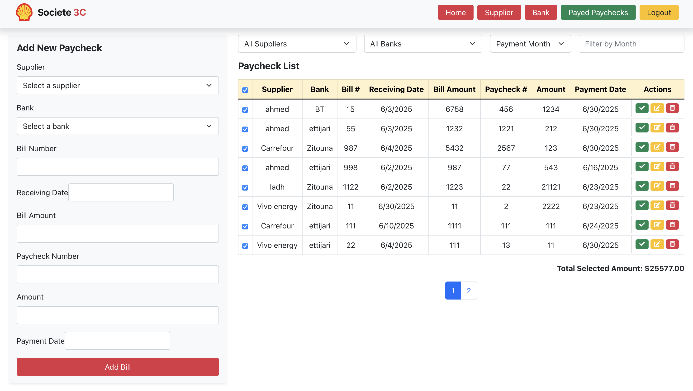
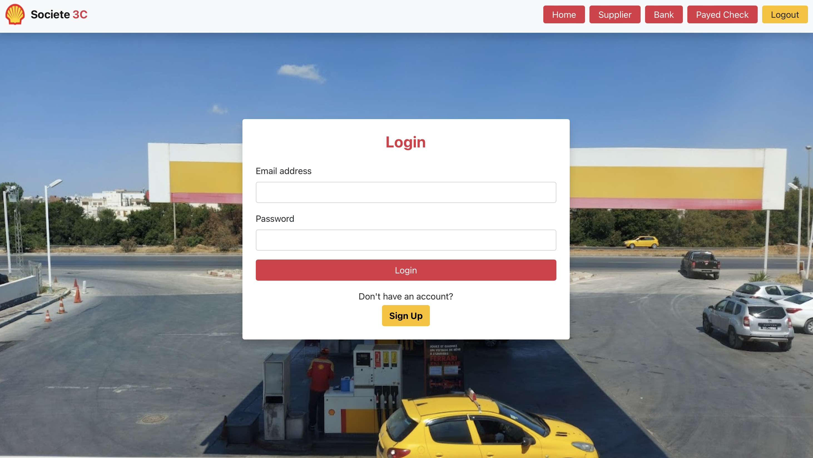

# 💼 Paycheck Management System

A robust, full-featured web application designed to simplify the management of supplier paychecks and bank transactions. Built using the **MERN stack**—**MongoDB**, **Express.js**, **React**, and **Node.js**—this system allows businesses to track, filter, and manage paychecks with a clean and responsive interface.

  
*Paycheck Management Dashboard*

---

## 🚀 Features

### ✅ Authentication
- Secure login system
- Protected routes using context API
- Token-based localStorage authentication


### 👥 Supplier Management
- Add new suppliers
- Edit or delete existing suppliers
- Select suppliers while adding paychecks  
 

### 🏦 Bank Management
- Add/edit/delete banks
- Associate banks with paycheck records
  


### 💵 Add & Manage Paychecks
- Create paychecks with supplier, bank, amounts, and dates
- Client-side validation and required field alerts  


### 🔍 Filter & Search
- Filter paychecks by:
  - Supplier
  - Bank
  - Date range (Receiving or Payment)
  - Paid/unpaid status  


### ✏️ Update & Delete Records
- Modify paycheck or delete entries with confirmation prompts  
!

### ✔️ Mark as Paid
- Instantly mark paychecks as paid
- Automatically move to the paid section  


### 🧮 Compute Totals
- Select multiple paychecks
- See total selected amount instantly  


---

## 🔐 Authentication

- Token-based login
- Protected routes with React Router and `PrivateRoute` component
- Redirects to `/login` when not authenticated

---

## 🛠️ Tech Stack

| Frontend      | Backend         | Database  | UI/UX       |
| ------------- | --------------- | --------- | ----------- |
| React         | Node.js, Express| MongoDB   | Bootstrap 5 |


## 📂 Project Structure

```
client/             # React frontend
  └── components/
  └── pages/
  └── context/AuthContext.js
  └── App.js

server/             # Express backend
  └── models/
  └── routes/
  └── controllers/
  └── middleware/
  └── server.js
```

---

## 🧪 How to Run Locally

## Getting Started

1. Clone the repository  
    ```bash
    git clone https://github.com/AhmedBelghith24/Paycheck-Management-System.git
    ```
2. Install backend dependencies  
    ```bash
    cd crud-users
    npm install
    ```
3. Install frontend dependencies  
    ```bash
    cd client
    npm install
    ```
4. Run backend server  
    ```bash
    npm start
    ```
5. Run frontend development server (in another terminal)  
    ```bash
    cd client
    npm start
    ```
6. Open your browser at `http://localhost:3000` and enjoy!

## Future Improvements

- User authentication and role-based access control  
- Export paycheck reports in CSV or PDF  
- Notifications and reminders for upcoming payments  
- Advanced analytics and dashboard visualization
